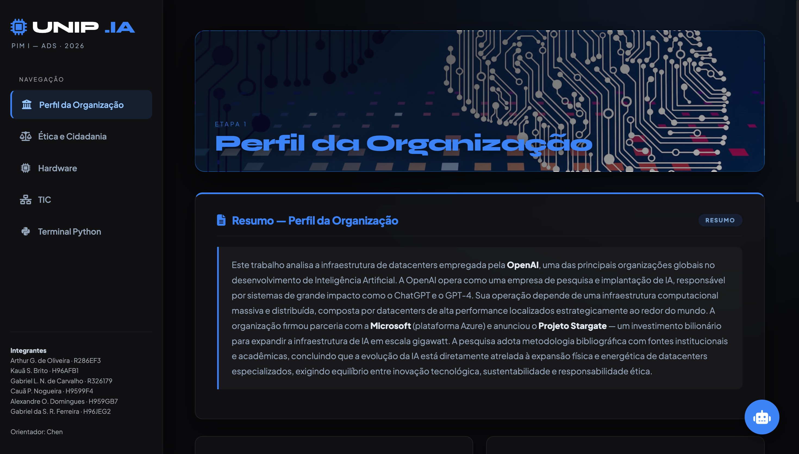
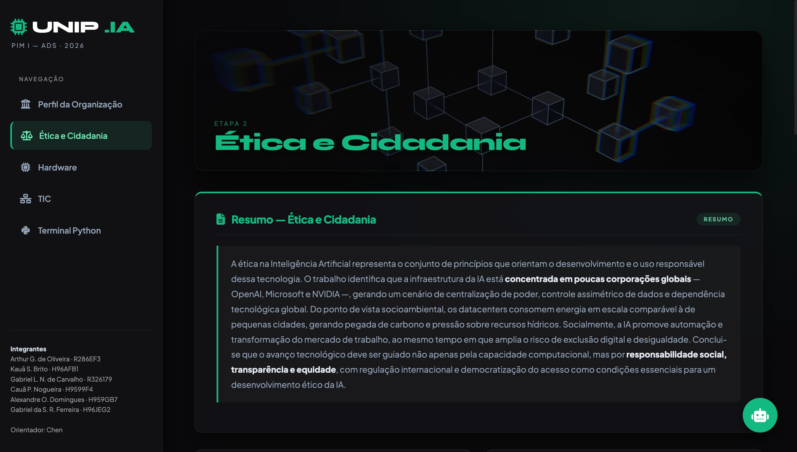
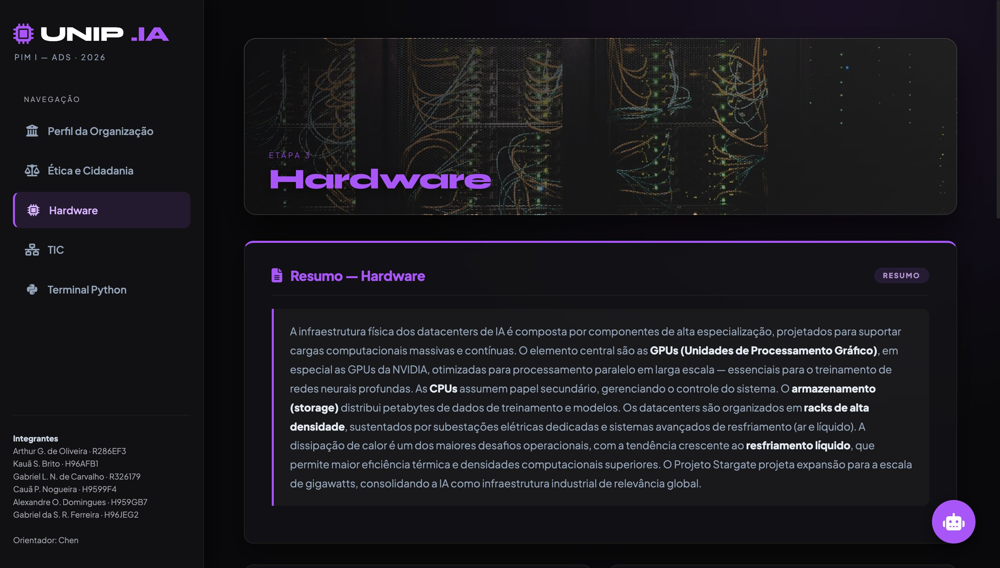
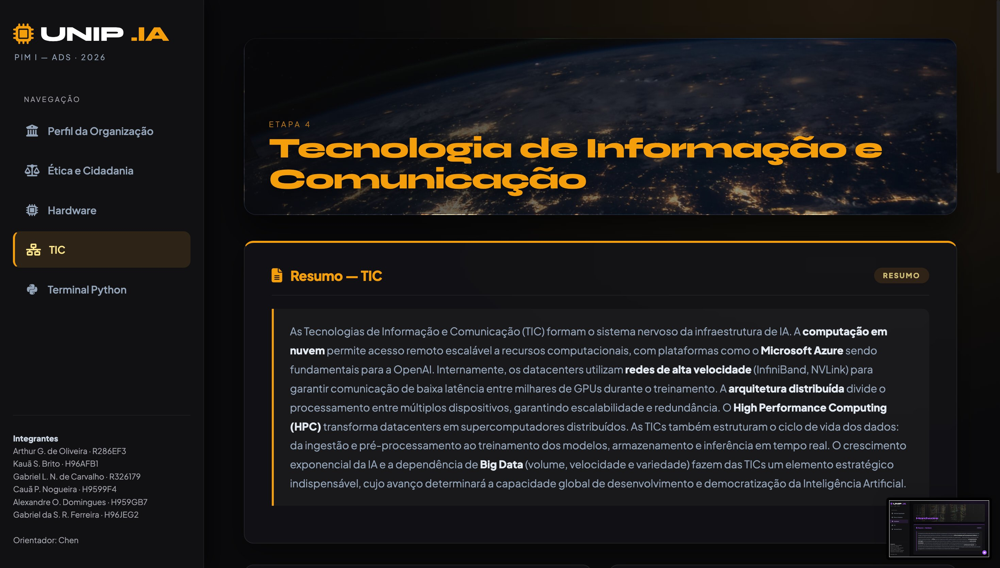
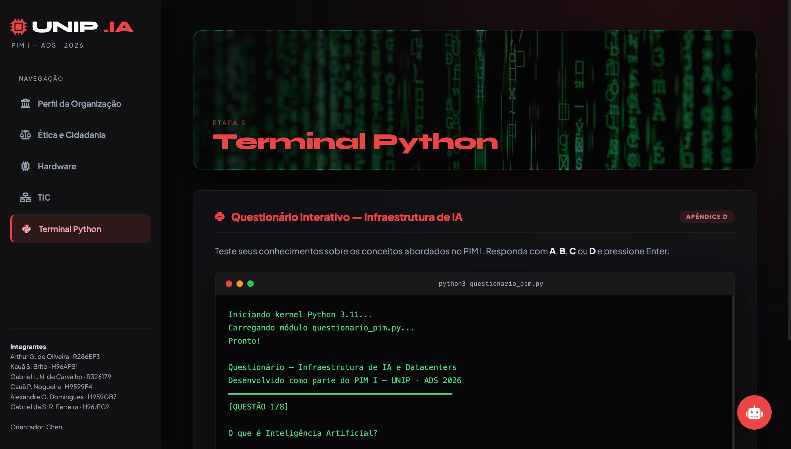
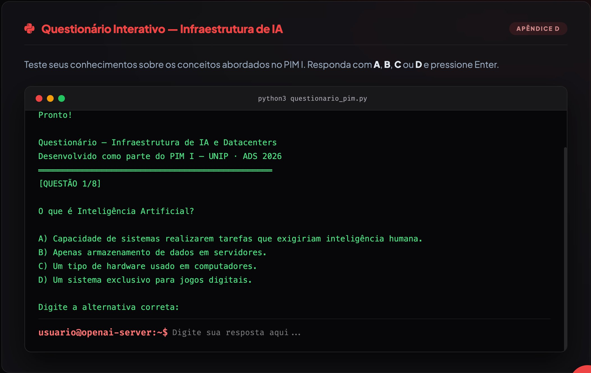

<div align="center">

# 🤖 UNIP.IA — Datacenters da OpenAI

### Projeto Integrado Multidisciplinar I · Análise e Desenvolvimento de Sistemas · 2026

[](https://developer.mozilla.org/pt-BR/docs/Web/HTML)
[](https://developer.mozilla.org/pt-BR/docs/Web/CSS)
[](https://developer.mozilla.org/pt-BR/docs/Web/JavaScript)
[](https://www.unip.br)

</div>

---

## 📌 Sobre o Projeto

O **UNIP.IA** é uma aplicação web interativa desenvolvida como **Projeto Integrado Multidisciplinar I (PIM I)** do curso de Análise e Desenvolvimento de Sistemas da UNIP. O projeto realiza uma análise multidisciplinar aprofundada da infraestrutura de **datacenters da OpenAI**, abordando cinco eixos temáticos em uma interface moderna com dark mode, navegação lateral responsiva e chatbot temático integrado.

A proposta conecta disciplinas como Fundamentos de TIC, Ética e Cidadania, Hardware e Programação Python em um único site interativo e visualmente rico.

---

## 🖼️ Screenshots

### Etapa 1 — Perfil da Organização

> Análise do histórico e escala da OpenAI, parceria com a Microsoft (Azure) e o bilionário Projeto Stargate.

---

### Etapa 2 — Ética e Cidadania

> Centralização tecnológica, controle assimétrico de dados, impacto ambiental e exclusão digital.

---

### Etapa 3 — Hardware

> GPUs NVIDIA H100/A100, racks de alta densidade, resfriamento líquido e consumo em escala de gigawatts.

---

### Etapa 4 — Tecnologia da Informação e Comunicação (TIC)

> Computação em nuvem (Azure), HPC, redes InfiniBand/NVLink e arquitetura distribuída.

---

### Etapa 5 — Terminal Python

> Terminal interativo simulando um ambiente Python com questionário de múltipla escolha sobre os conteúdos do PIM.

---

### Questionário Interativo — Apêndice D

> 8 questões de múltipla escolha (A/B/C/D) para testar os conhecimentos sobre Infraestrutura de IA e Datacenters.

---

## 📚 Conteúdo Abordado

| Etapa | Disciplina | Tema Principal |
|---|---|---|
| 1 | Perfil da Organização | OpenAI, ChatGPT, GPT-4 e Projeto Stargate |
| 2 | Ética e Cidadania | Centralização, privacidade e impacto socioambiental |
| 3 | Hardware | GPUs, CPUs, racks, resfriamento e storage |
| 4 | TIC | Cloud, HPC, redes de alta velocidade e Big Data |
| 5 | Terminal Python | Questionário interativo simulando um terminal real |

---

## ✨ Funcionalidades

- 🌑 **Dark Mode** com gradientes dinâmicos por seção (azul, verde, roxo, âmbar, vermelho)
- 🗂️ **Navegação lateral (sidebar)** com destaque por cor em cada etapa
- 📱 **Responsivo** — menu hambúrguer para dispositivos móveis
- 🤖 **Chatbot temático** com base de conhecimento sobre o conteúdo do PIM
- 🖥️ **Terminal Python simulado** com questionário interativo de 8 questões
- 🎨 Animações de entrada (`fadeUp`) e transições suaves entre seções
- 📄 Cards de resumo e conteúdo em cada etapa

---

## 🛠️ Tecnologias Utilizadas

- **HTML5** — Estrutura semântica da aplicação
- **CSS3** — Variáveis CSS, Flexbox, Grid, animações e gradientes
- **JavaScript Vanilla** — Navegação SPA, chatbot e simulação do terminal
- **Font Awesome** — Ícones da interface
- **Google Fonts** — Tipografia (Plus Jakarta Sans + Syne)

---

## 🚀 Como Executar

Por ser um único arquivo HTML autocontido, basta abrir no navegador:

```bash
# Clone o repositório
git clone https://github.com/seu-usuario/unip-ia-openai.git

# Acesse a pasta
cd unip-ia-openai

# Abra o arquivo no navegador
open UNIP_IA_OpenAI.html
# ou simplesmente dê duplo clique no arquivo
```

> **Requisitos:** Apenas um navegador moderno (Chrome, Firefox, Edge, Safari). Nenhuma dependência externa ou servidor necessário.

---

## 👥 Integrantes

| Nome | RA |
|---|---|
| Arthur G. de Oliveira | R286EF3 | www.linkedin.com/in/arthur-gonçalves-de-oliveira-0079b33a3 |
| Kauã S. Brito | H96AFB1 |
| Gabriel L. N. de Carvalho | R326179 |
| Cauã P. Nogueira | H9599F4 |
| Alexandre O. Domingues | H959GB7 |
| Gabriel da S. R. Ferreira | H96JEG2 |

**Orientador:** Prof. Chen

---

## 🏫 Informações Acadêmicas

- **Instituição:** UNIP — Universidade Paulista
- **Curso:** Análise e Desenvolvimento de Sistemas (ADS)
- **Projeto:** PIM I — Projeto Integrado Multidisciplinar I
- **Ano:** 2026
- **Metodologia:** Pesquisa bibliográfica com fontes institucionais e acadêmicas

---

## 📄 Licença

Este projeto foi desenvolvido para fins **acadêmicos** no contexto do PIM I da UNIP. Uso livre para referência e estudo.

---

<div align="center">

Feito com ☕  e pelo grupo de ADS 2026 — UNIP

</div>
